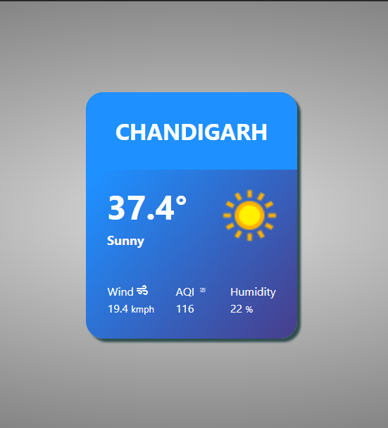

# 🌤️ Weather Widget App

A simple React weather widget that displays the **current weather** of your city in a clean, compact format. It fetches real-time data from [WeatherAPI](https://www.weatherapi.com/) and presents it in an elegant card layout.



---

## 📦 Features

The widget shows:

- 🏙️ City name
- 🌡️ Temperature (°C)
- 🌤️ Weather condition (text + icon)
- 🌬️ Wind speed
- 🧪 Air Quality Index (AQI)
- 💧 Humidity

---

## 🛠️ Tech Stack

- HTML  
- CSS (Flexbox for layout)  
- JavaScript  
- React  
- Axios  
- react-icons  

---

## 📥 Getting Started

### 1. Clone the repo

```bash
git clone https://github.com/2018csb1082/Weather-App.git
cd Weather-App
```

### 2. Install dependencies

```bash
npm install
# or
yarn install
```

### 3. Get your API key

- Sign up at [https://www.weatherapi.com](https://www.weatherapi.com)
- Copy your API key from the dashboard

### 4. Create `.env` file

```env
VITE_WEATHER_API_KEY=your_api_key_here
```

### 5. Run the app

```bash
npm run dev
# or
yarn dev
```

---

## 🔌 API Used

```http
GET http://api.weatherapi.com/v1/current.json
```

---

## 📁 Folder Structure

```
src/
├── assets/
│   └── final_product/
│       └── screenshot.PNG
├── components/
│   └── WeatherContainer.jsx
├── App.jsx
├── main.jsx
├── styles/
│   └── WeatherContainer.css
```

---

## ✨ Possible Future Enhancements

- Auto-location detection via geolocation API  
- Extended forecast (5-day / hourly)  
- Dark mode toggle

---

## 📄 License

MIT License © [Daksh Sharma] 2025

---

🔗 GitHub Repo: [https://github.com/2018csb1082/Weather-App](https://github.com/2018csb1082/Weather-App)